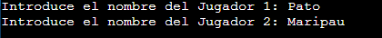
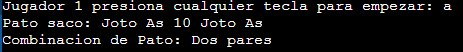
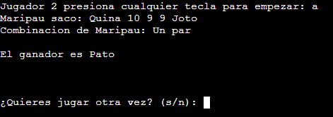

# 🎲 Juego de Mesa: Cubiletes

👨‍🎓 Desarrollado por: Patricio Adulfo Villanueva Gío y María Paula Pérez Romo

📚 Carrera: Ingeniería en Ciencia de Datos (5to semestre)

## 📝 Descripción
Este código simula el famoso juego de mesa "Cubiletes", donde dos jugadores lanzan cinco dados y compiten para obtener la mejor combinación de resultados. El juego se desarrolla mediante el uso de funciones que gestionan las tiradas, determinan las combinaciones, y resuelven cualquier empate entre los jugadores.

## 🔍 Funciones Principales
El código consta de tres funciones principales, además de la función main, las cuales son:

### 1. calcular_combinacion 📊
Esta función tiene como objetivo analizar la frecuencia de los valores obtenidos en los dados de un jugador y determinar qué combinación representa dicha tirada.

- 📥 Parámetros:
  - Recibe una lista de enteros de tamaño 6, donde cada elemento cuenta cuántas veces apareció un valor específico en la tirada (valores que van del 9 al As).
- ⚙️ Proceso:
  - Calcula cuántas veces se repite cada valor para encontrar la cantidad máxima de repeticiones (masRepetido).
  - Comprueba las diferentes combinaciones posibles, tales como Quintilla, Póker, Full house, Tercia, Dos pares, Un par, o Nada.
- 📤 Valor de Retorno:
  - Devuelve un número entero representando la combinación obtenida, donde:
    - 0 es Nada (también llamado "Pachuca") 
    - 6 es Quintilla 

### 2. imprimir_resultados 🖨️
Esta función imprime los resultados de la tirada de un jugador, incluyendo los valores obtenidos en los dados y la combinación que representan.

- 📥 Parámetros:
  + El nombre del jugador.
  + Un arreglo con los resultados de los cinco dados lanzados.
  + El tipo de combinación obtenida.
  + Un arreglo de cadenas que contiene los nombres de los valores de las cartas (del "9" al "As").
- ⚙️ Proceso:
  - Imprime los valores obtenidos en la tirada e imprime el nombre de la combinación correspondiente utilizando un switch basado en el valor de combinacion.
  
(Yo sé que no lo hemos visto en clase y que podría perfectamente ser reemplazado con if else, pero se veía lindo). 😅

### 3. desempatar 🤜🤛
(Antes de explicar esta función... Para qué le miento, profe, primero no pensamos en que los usuarios pudieran empatar, así que luego nos dimos cuenta de que si ambos sacaban la misma puntuación debíamos comparar las cartas, así que la creamos). 🙃

Esta función maneja los casos de empate entre dos jugadores cuando ambos obtienen la misma combinación de dados. Dependiendo de la combinación obtenida, se aplican diferentes reglas de desempate.

- 📥 Parámetros:
  - Una lista de enteros que representa la frecuencia de cada valor en los dados del jugador 1.
  - Una lista de enteros similar para el jugador 2.
  - Un entero que indica la combinación obtenida por ambos jugadores (ya que están empatados en este punto).
- ⚙️ Proceso:
  - Para cada combinación posible (Un par, Dos pares, Tercia, Full house), se evalúan las reglas de desempate.
  - Por ejemplo, si ambos jugadores tienen un par, se compara el valor del par más alto. Si ambos tienen el mismo par, se considera el dado más alto individual.
- 📤 Valor de Retorno:
  - Devuelve un entero que representa el resultado del desempate:
    - 1: Gana el jugador 1 🏆
    - 2: Gana el jugador 2 🏆
    - 0: Empate 🤝

---

### ▶️ Ejecución del Juego (flujo main)
El flujo del juego es gestionado en la función main, que se encarga de:
- 📝 Solicitar los nombres de los dos jugadores.
- 🎲 Generar aleatoriamente los valores de los cinco dados para cada jugador.
- 📊 Calcular las combinaciones mediante calcular_combinacion.
- 🖨️ Imprimir los resultados utilizando imprimir_resultados.
- 🏅 Determinar el ganador o aplicar las reglas de desempate mediante desempatar.
- 🔄 Permitir a los jugadores decidir si quieren jugar otra vez.

---

## Estructura de los archivos
```bash
|-Cubiletes
|
|--archivosC
|----cubiletes.c
|
|--ejecutables
|----cubiletes
````

## Forma de ejecucion
Clonar el repositorio
```bash
git clone https://github.com/ioSoyPato/Cubiletes.git
```
Abrir la carpeta clonada
```bash
cd Cubiletes/archivosC
```
Compilar el archivo C en la carpeta ejecutables
```bash
gcc -o ../ejecutables/cubiletes cubiletes.c
```
Cambiar a la carpeta ejecutables
```bash
cd ../ejecutables
```
Ejecutar el programa
```bash
./cubiletes
```

## Como jugar
Primero ingresas el nombre de los jugadores



Luego el jugador 1 debe introducir cualquier letra y ejecutar enter



`Solo el programa mostrara sus dados y su combinación`

El jugador 2 debe repetir el mismo proceso



`Solo el programa mostrara sus dados y su combinación asi como el ganador y preguntara si se desea continuar jugando`


## Explicacion del codigo
### Documentation Section
Esta sección del código tiene un comentario extenso que explica las principales funcionalidades y el flujo del programa. Es útil para que otros desarrolladores entiendan el propósito del programa y las funciones clave que se van a usar.

### Prototypes Declaration Section
Aquí se declaran los prototipos de las funciones que se van a usar más adelante en el programa. Esta sección le dice al compilador qué funciones estarán disponibles.
```c
int calcular_combinacion(int count[6]);
void imprimir_resultados(char* nombre, int array[5], int combinacion, const char* valores[]);
int desempatar(int count1[6], int count2[6], int combinacion);
```

### Main Function (main())
La función principal del programa donde se ejecuta el flujo del juego. Aquí se inicializan las variables, se piden entradas del usuario, se realizan las tiradas de los dados y se determina al ganador.
```c
int main() {
    // Declaración de variables que vamos a usar en el programa 
    int array1[5], array2[5];
    int count1[6] = {0}, count2[6] = {0};
    int combinacion1 = 0, combinacion2 = 0;
    char nombre1[20], nombre2[20];
    char respuesta;
    const char* valores[] = {"9", "10", "Joto", "Reina", "Rey", "As"};
    char tecla;
    
    // Inicializar la semilla del generador de números aleatorios con la libreria tiempo 
    time_t t;
    srand((unsigned int)time(&t));
    
    // Ponemos respuesta en 's' para que empiece el while
    respuesta = 's';

    // Ciclo para repetir el juego mientras el usuario quiera
    while (respuesta == 's' || respuesta == 'S') {
        // Resetear contadores para nueva partida
        for (int i = 0; i < 6; i++) {
            count1[i] = 0;
            count2[i] = 0;
        }

        // Obtener nombres de los jugadores
        printf("Introduce el nombre del Jugador 1: ");
        scanf("%19s", nombre1); // Evitar overflow
        printf("Introduce el nombre del Jugador 2: ");
        scanf("%19s", nombre2);

        // Generar tiradas y resultados para cada jugador
        printf("\nJugador 1 presiona cualquier tecla para empezar: ");
        scanf("%s", &tecla);
        for (int i = 0; i < 5; i++) {
            array1[i] = rand() % 6 + 1;
            count1[array1[i] - 1]++;
        }
        combinacion1 = calcular_combinacion(count1);
        imprimir_resultados(nombre1, array1, combinacion1, valores);

        printf("\nJugador 2 presiona cualquier tecla para empezar: ");
        scanf("%s", &tecla);
        for (int i = 0; i < 5; i++) {
            array2[i] = rand() % 6 + 1;
            count2[array2[i] - 1]++;
        }
        combinacion2 = calcular_combinacion(count2);
        imprimir_resultados(nombre2, array2, combinacion2, valores);

        // Determinar el ganador basado en las reglas de desempate
        if (combinacion1 > combinacion2) {
            printf("\nEl ganador es %s\n", nombre1);
        } else if (combinacion2 > combinacion1) {
            printf("\nEl ganador es %s\n", nombre2);
        } else {
            int resultado = desempatar(count1, count2, combinacion1);
            if (resultado == 1) {
                printf("\nEl ganador es %s\n", nombre1);
            } else if (resultado == 2) {
                printf("\nEl ganador es %s\n", nombre2);
            } else {
                printf("\nEs un empate\n");
            }
        }

        // Preguntar si desean jugar otra vez
        printf("\n\n\n¿Quieres jugar otra vez? (s/n): ");
        scanf(" %c", &respuesta);
    }

    return 0;
}
```
- int array1[5], array2[5];: Arrays que contienen los resultados de los cinco dados lanzados por cada jugador.

- int count1[6] = {0}, count2[6] = {0};: Arrays que cuentan la frecuencia de cada valor (del "9" al "As") en la tirada.
- int combinacion1 = 0, combinacion2 = 0;: Variables que almacenan la combinación obtenida por cada jugador.
- char nombre1[20], nombre2[20];: Nombres de los jugadores.
- char respuesta;: Respuesta del usuario para saber si quiere jugar otra partida.
- const char* valores[] = {"9", "10", "Joto", "Reina", "Rey", "As"};: Array de cadenas para imprimir los nombres de las cartas.
- char tecla;: Variable para capturar la entrada del jugador antes de lanzar los dados.
- time_t t;: Variable para inicializar la semilla del generador de números aleatorios.

### Subprogram Section
Aquí están definidas las funciones que se encargan de las operaciones específicas del juego, como calcular la combinación, imprimir los resultados, y desempatar en caso de que sea necesario.

#### 1. calcular_combinacion
Esta función analiza la frecuencia de cada valor y determina la combinación que representa la tirada.

```c
int calcular_combinacion(int count[6]) {
    int masRepetido = 0, tienePar = 0, pares = 0;

    for (int i = 0; i < 6; i++) {
        if (count[i] > masRepetido) {
            masRepetido = count[i];
        }
        if (count[i] == 2) {
            pares++;
            tienePar = 1;
        }
    }

    if (masRepetido == 5) {
        return 6; // Quintilla
    } else if (masRepetido == 4) {
        return 5; // Póker
    } else if (masRepetido == 3) {
        if (tienePar) {
            return 4; // Full house
        } else {
            return 3; // Tercia
        }
    } else if (masRepetido == 2) {
        if (pares == 2) {
            return 2; // Dos pares
        } else {
            return 1; // Un par
        }
    } else {
        return 0; // Nada
    }
}
```

#### 2. imprimir_resultados
Esta función imprime los resultados de una tirada y la combinación que representa.
```c
void imprimir_resultados(char* nombre, int array[5], int combinacion, const char* valores[]) {
    printf("%s saco: ", nombre);
    for (int i = 0; i < 5; i++) {
        printf("%s ", valores[array[i] - 1]);
    }
    printf("\nCombinacion de %s: ", nombre);
    switch (combinacion) {
        case 6: printf("Quintilla\n"); break;
        case 5: printf("Póker\n"); break;
        case 4: printf("Full house\n"); break;
        case 3: printf("Tercia\n"); break;
        case 2: printf("Dos pares\n"); break;
        case 1: printf("Un par\n"); break;
        default: printf("Nada\n"); break;
    }
}
```
### 3. desempatar
Esta función resuelve los empates entre dos jugadores cuando obtienen la misma combinación.
```c
int desempatar(int count1[6], int count2[6], int combinacion) {
    switch (combinacion) {
        case 1: { // Un par
            for (int i = 5; i >= 0; i--) {
                if (count1[i] == 2 && count2[i] != 2) return 1;
                if (count2[i] == 2 && count1[i] != 2) return 2;
            }
            for (int i = 5; i >= 0; i--) {
                if (count1[i] == 1 && count2[i] == 1) continue;
                if (count1[i] == 1) return 1;
                if (count2[i] == 1) return 2;
            }
            return 0; // Empate
        }
        case 2: { // Dos pares
            int parMayor1 = 0, parMayor2 = 0, parMenor1 = 0, parMenor2 = 0;
            for (int i = 5; i >= 0; i--) {
                if (count1[i] == 2) {
                    if (parMayor1 == 0) parMayor1 = i + 1;
                    else parMenor1 = i + 1;
                }
                if (count2[i] == 2) {
                    if (parMayor2 == 0) parMayor2 = i + 1;
                    else parMenor2 = i + 1;
                }
            }
            if (parMayor1 != parMayor2) return (parMayor1 > parMayor2) ? 1 : 2;
            if (parMenor1 != parMenor2) return (parMenor1 > parMenor2) ? 1 : 2;
            for (int i = 5; i >= 0; i--) {
                if (count1[i] == 1 && count2[i] != 1) return 1;
                if (count2[i] == 1 && count1[i] != 1) return 2;
            }
            return 0; // Empate
        }
        case 3: { // Tercia
            int valorTercia1 = 0, valorTercia2 = 0;
            for (int i = 5; i >= 0; i--) {
                if (count1[i] == 3) valorTercia1 = i + 1;
                if (count2[i] == 3) valorTercia2 = i + 1;
            }
            if (valorTercia1 != valorTercia2) return (valorTercia1 > valorTercia2) ? 1 : 2;
            for (int i = 5; i >= 0; i--) {
                if (count1[i] == 1 && count2[i] != 1) return 1;
                if (count2[i] == 1 && count1[i] != 1) return 2;
            }
            return 0; // Empate
        }
        case 4: { // Full house
            int valorTercia1 = 0, valorTercia2 = 0;
            for (int i = 5; i >= 0; i--) {
                if (count1[i] == 3) valorTercia1 = i + 1;
                if (count2[i] == 3) valorTercia2 = i + 1;
            }
            return (valorTercia1 > valorTercia2) ? 1 : (valorTercia2 > valorTercia1) ? 2 : 0;
        }
        default:
            return 0; // Empate para combinaciones más altas
    }
}
```

## Explicación adicional (desempatar)
Aqui es una explicación de nuestra unica función "dificil" de entender porque pues siii en efecto esta medio ocaciono embolias en el equipo y no dire a quien pero a mi no fue (Pero usted no sabe quien escribio esto) (pd. fue pato)

### Función desempatar

#### Parámetros de entrada:

- __int count1[6]__: Representa la frecuencia de cada valor (del "9" al "As") en los dados del Jugador 1. Por ejemplo, count1[i] indica cuántas veces apareció el valor i+1.

- __int count2[6]__: Similar a count1, pero para el Jugador 2.

- __int combinacion__: Un número que indica el tipo de combinación de dados que ambos jugadores han sacado y están empatados. El valor de combinacion puede ser:

  - 1: Un par
  - 2: Dos pares
  - 3: Tercia
  - 4: Full house

Lo que hace la función: La función evalúa las combinaciones de ambos jugadores y devuelve:

- __1__ si el Jugador 1 gana el desempate.
- __2__ si el Jugador 2 gana el desempate.
- __0__ si el empate persiste después de todas las reglas.

`Veamos cada caso en detalle con ejemplos:`

### Caso 1: Un Par (combinacion == 1)
Explicación: En este caso, ambos jugadores tienen un par, y la función intenta desempatar buscando cuál par tiene un valor mayor. Si ambos tienen el mismo par, se comparan los valores restantes de los dados.

```c
case 1: { // Un par
    for (int i = 5; i >= 0; i--) {
        if (count1[i] == 2 && count2[i] != 2) return 1;
        if (count2[i] == 2 && count1[i] != 2) return 2;
    }
    for (int i = 5; i >= 0; i--) {
        if (count1[i] == 1 && count2[i] == 1) continue;
        if (count1[i] == 1) return 1;
        if (count2[i] == 1) return 2;
    }
    return 0; // Empate
}
```
Ejemplo:

- Jugador 1: `{0, 1, 2, 1, 0, 1}` → Tiene un par de Joto (2 veces) y dos 10.
- Jugador 2: `{1, 0, 2, 1, 1, 0}` → Tiene un par de Joto (2 veces) y un 9 y un Reina.

Ambos tienen un par del mismo valor (Joto). La función entonces compara los dados restantes:

- Jugador 1 tiene `10`, `10`, y `Reina`.
- Jugador 2 tiene `9`, `Reina`, y `Rey`.

El dado más alto es `Rey` de Jugador 2, así que Jugador 2 gana.

### Caso 2: Dos Pares (combinacion == 2)
Explicación: En este caso, ambos jugadores tienen dos pares. Se comparan los valores de los pares más altos primero, luego los pares menores, y finalmente el dado restante.

```c
case 2: { // Dos pares
    int parMayor1 = 0, parMayor2 = 0, parMenor1 = 0, parMenor2 = 0;
    for (int i = 5; i >= 0; i--) {
        if (count1[i] == 2) {
            if (parMayor1 == 0) parMayor1 = i + 1;
            else parMenor1 = i + 1;
        }
        if (count2[i] == 2) {
            if (parMayor2 == 0) parMayor2 = i + 1;
            else parMenor2 = i + 1;
        }
    }
    if (parMayor1 != parMayor2) return (parMayor1 > parMayor2) ? 1 : 2;
    if (parMenor1 != parMenor2) return (parMenor1 > parMenor2) ? 1 : 2;
    for (int i = 5; i >= 0; i--) {
        if (count1[i] == 1 && count2[i] != 1) return 1;
        if (count2[i] == 1 && count1[i] != 1) return 2;
    }
    return 0; // Empate
}
```
Ejemplo:

- Jugador 1: `{0, 2, 0, 2, 1, 0}` → Dos pares de 10 y Reina y un Rey.
- Jugador 2: `{1, 0, 2, 2, 0, 0}` → Dos pares de Joto y Reina y un 9.

Comparando los pares mayores:
- Jugador 1 tiene el par mayor de `Reina` y Jugador 2 también.

Comparando los pares menores:
- Jugador 1 tiene `10` y Jugador 2 tiene `Joto`.


Como `Joto` __es mayor__ que `10`, Jugador 2 gana.

### Caso 3: Tercia (combinacion == 3)
Explicación: En el caso de que ambos jugadores tengan una tercia, se compara el valor de la tercia. Si ambas son iguales, se comparan los dados restantes.

```c
case 3: { // Tercia
    int valorTercia1 = 0, valorTercia2 = 0;
    for (int i = 5; i >= 0; i--) {
        if (count1[i] == 3) valorTercia1 = i + 1;
        if (count2[i] == 3) valorTercia2 = i + 1;
    }
    if (valorTercia1 != valorTercia2) return (valorTercia1 > valorTercia2) ? 1 : 2;
    for (int i = 5; i >= 0; i--) {
        if (count1[i] == 1 && count2[i] != 1) return 1;
        if (count2[i] == 1 && count1[i] != 1) return 2;
    }
    return 0; // Empate
}
```
Ejemplo:

- Jugador 1: `{0, 3, 0, 0, 1, 1}` → Tercia de `10` y un `Rey` y un `As`.
- Jugador 2: `{0, 3, 0, 0, 0, 2}` → Tercia de `10` y dos `As`.

Ambos tienen la misma tercia (10). Al comparar los dados restantes:

- Jugador 1 tiene `Rey` y `As`.
- Jugador 2 tiene dos `As`.

Jugador 2 tiene un dado más alto (`As` repetido), así que gana.

### Caso 4: Full House (combinacion == 4)
Explicación: Si ambos jugadores tienen un Full House, se desempata comparando el valor de la tercia en el Full House.

```c
case 4: { // Full house
    int valorTercia1 = 0, valorTercia2 = 0;
    for (int i = 5; i >= 0; i--) {
        if (count1[i] == 3) valorTercia1 = i + 1;
        if (count2[i] == 3) valorTercia2 = i + 1;
    }
    return (valorTercia1 > valorTercia2) ? 1 : (valorTercia2 > valorTercia1) ? 2 : 0;
}
```
Ejemplo:

- Jugador 1: `{0, 3, 0, 2, 0, 0}` → Full House con tercia de `10` y par de `Reina`.
- Jugador 2: `{0, 0, 3, 2, 0, 0}` → Full House con tercia de `Joto` y par de `Reina`.

La tercia de Jugador 2 (`Joto`) es mayor que la tercia de Jugador 1 (`10`), así que Jugador 2 gana.


### En fin entonces que hace esta bella función
La función desempatar maneja los diferentes casos de empate evaluando cada combinación de acuerdo a reglas específicas:

- Un Par: Se compara el valor del par y, si es igual, los valores restantes.

- Dos Pares: Se comparan los pares mayores y menores, y luego el dado restante.
- Tercia: Se compara el valor de la tercia y luego los valores restantes.
- Full House: Se compara el valor de la tercia en el Full House.

